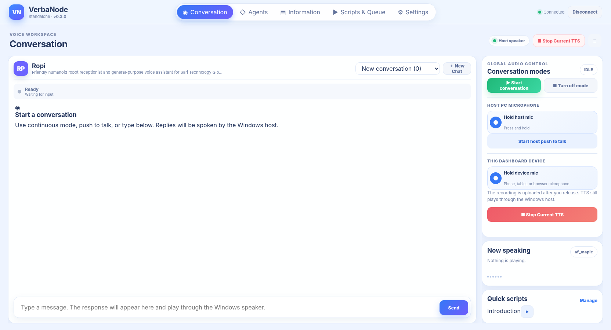
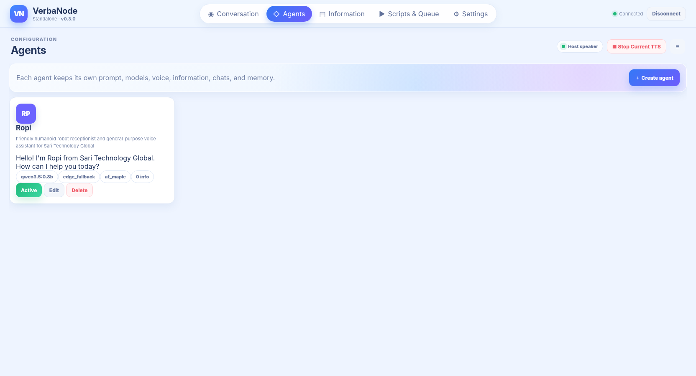
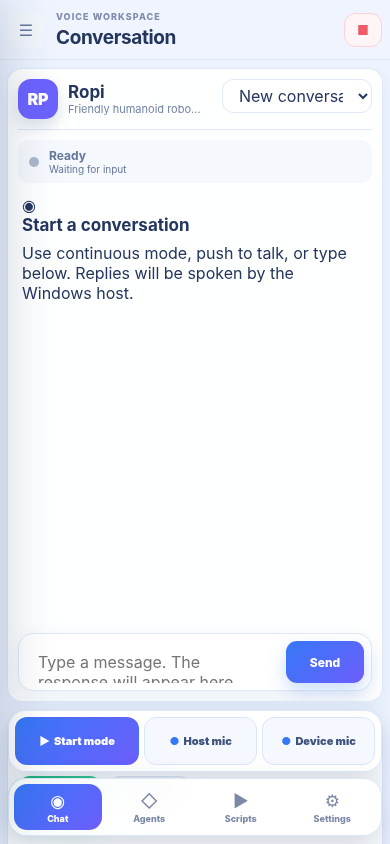

# VerbaNode

VerbaNode is a Windows-hosted, CPU-capable voice assistant with a responsive browser dashboard. AI processing and host audio run on the Windows PC. A desktop browser or phone can control the system over the local network, and browser-device push-to-talk can use the phone microphone over HTTPS.

**Current release:** v0.3.3 natural core-tool routing.

## Main features

- Multiple editable agents with independent identity and character instructions, Ollama models, TTS voices, information, tools, memory, and chat history.
- Continuous conversation, host push-to-talk, browser-device push-to-talk, typed chat, and Stop Current TTS.
- Silero VAD, SenseVoice/FunASR, Ollama, Edge TTS, and local Sherpa-ONNX Kokoro.
- Sentence-buffered LLM-to-TTS streaming while chat remains one assistant message.
- Global script buttons with queue controls and persistent audio caching.
- SQLite storage, backup/restore, and per-agent memory.
- Selectable host input/output devices with persistent streams and device fingerprint recovery.
- One active controller; a valid PIN transfers control immediately.


## v0.3.3 natural core-tool routing

- Current time/date requests now bypass the LLM even when preceded by greetings, wake words, or polite filler, such as **“hello Ropi, what time is it?”**.
- Minor ASR or typing errors such as **“what day its its?”** are recognized conservatively as current date/time requests.
- Greeting handling also applies to configured-location, live-weather, and stop-conversation requests.
- Unrelated questions such as **“What is time complexity?”** and **“What time does the meeting start?”** continue to reach the LLM normally.
- Direct time responses are generated from `VERBANODE_DEFAULT_TIMEZONE` and cannot be guessed by the model.


## v0.3.2 layered prompt architecture

- Agent-editable instructions now contain only identity, domain, personality, tone, and speaking style.
- Tool selection policy, memory policy, safety rules, TTS formatting, retrieved knowledge handling, and runtime context are composed internally by VerbaNode.
- Deterministic routing still handles obvious time/date, location, weather, and stop-conversation requests before the LLM.
- The agent editor labels the field as **Character instructions** and explains which concerns are handled internally.
- The AI role generator no longer writes operational tool, memory, safety, or runtime instructions into agent characters.
- Existing v0.3.1 default Ropi prompts migrate once; customized Ropi character prompts are preserved.


## v0.3.1 reliability patch

- Made the default Ropi role more concrete, concise, and explicit about physical-action limits.
- Added mandatory tool rules: current time/date, configured location, weather, and conversation-stop requests must use their tools and must never be guessed.
- Added conservative deterministic routing for obvious core requests such as “What time is it?” so `qwen3.5:0.8b` cannot skip the tool call.
- Restored the four core tools for the Ropi agent during the one-time v0.3.1 database migration while preserving additional custom tools.
- Added configurable `VERBANODE_DEFAULT_TIMEZONE` with `Asia/Jakarta` as the default.
- Removed duplicate HTTP heartbeats while WebSocket is connected, which was the main source of recurring Windows HTTPS connection-reset noise.
- Suppressed only the known harmless `WinError 10054` Proactor cleanup callback; other asyncio errors remain visible.

## v0.3.0 Phase 1 improvements

- Authoritative pipeline state machine with `turn_id`, `capture_id`, and `generation_id` tracking.
- ASR timeout, one transient retry, immutable PCM snapshots, and direct PCM recognition before WAV fallback.
- Default estimated STT threshold reduced from 88% to 70%; deliberate custom values are preserved.
- Finite Ollama and tool timeouts, up to three tool rounds, and interrupted tool-call history repair.
- Faster first-clause TTS, bounded TTS queues, retries, and Edge/Kokoro circuit breaking.
- Audio device fingerprints and recovery metrics for Windows/PortAudio device-ID changes.
- Responsive XiaozhiConsole-inspired interface that fits one desktop viewport and provides phone drawer, bottom navigation, and fixed voice controls.

## Interface previews

### Desktop conversation



### Desktop agents



### Phone conversation



## Requirements

- Windows 10 or Windows 11, 64-bit.
- Miniconda or Anaconda.
- Ollama for Windows.
- 8 GB RAM minimum; CPU-only operation is supported.
- Devices on the same trusted local network for remote dashboard access.

## First-time setup

Open Command Prompt or PowerShell in the project folder:

```bat
setup_windows.bat
```

The setup script creates the `verbanode` Conda environment, installs dependencies, creates `.env`, and generates a random six-digit controller PIN.

Pull the default LLM:

```bat
ollama pull qwen3.5:0.8b
```

Create or migrate the SQLite database:

```bat
setup_database.bat
```

Download speech and local TTS models:

```bat
download_funasr.bat
download_kokoro.bat
```

Start VerbaNode with HTTPS:

```bat
run.bat
```

HTTPS is required for phone/browser microphone permission. Use `run_http.bat` only when browser-device microphone capture is not needed. Run `allow_firewall.bat` as Administrator to permit another device through Windows Firewall.

## Upgrade from v0.2.6

1. Back up the current installation and use the dashboard backup function for the database.
2. Replace repository files with v0.3.3, but keep your local `.env`, `data/`, `models/`, and `certs/` directories.
3. Run:

```bat
setup_windows.bat
setup_database.bat
```

4. Start with `run.bat`.

The application continues to use `data/verbanode.db`. Existing databases are migrated in place. Only the old default STT threshold of 88% is migrated to 70%; other custom threshold values remain unchanged.

## Database setup

The repository commits only `data/.gitkeep`; it does not commit a user database.

```bat
setup_database.bat
```

This creates or migrates `data/verbanode.db` and seeds Agent Ropi with:

- model `qwen3.5:0.8b`;
- temperature `0.2`;
- top-p `0.8`;
- maximum response tokens `224`;
- estimated STT confidence threshold `70%`.

To intentionally erase and recreate the database:

```bat
setup_database.bat --reset
```

The script requires typing `RESET` before deletion.

## Audio architecture

Phase 1 keeps the persistent microphone and speaker workers coordinated inside the main application process. It adds device fingerprints, bounded queues, state tracking, and recovery metrics before the larger Phase 2 change.

Phase 2 is planned to move microphone input, speaker output, VAD, device recovery, and audio coordination into one supervised Audio Engine process. Microphone and speaker should remain coordinated by that process rather than becoming fully independent processes.

## Project structure

```text
app/                         FastAPI application, services, database, and web UI
app/services/pipeline.py     Pipeline state, identifiers, metrics, and health
scripts/                     Model, certificate, audio-test, and database utilities
tests/                       Automated regression tests
data/.gitkeep                Empty runtime data directory placeholder
models/                      Download instructions; model binaries are ignored
docs/ui-preview/             Desktop and phone interface previews
setup_windows.bat            Conda environment and dependency setup
setup_database.bat           Create, migrate, or reset SQLite data
run.bat                      HTTPS launcher
run_http.bat                 Optional HTTP launcher
download_funasr.bat          SenseVoice model downloader
download_kokoro.bat          Kokoro model downloader
```

## Configuration

`setup_windows.bat` copies `.env.example` to `.env`. Important values include:

| Variable | Purpose |
| --- | --- |
| `VERBANODE_PIN` | Controller PIN |
| `VERBANODE_PORT` | Dashboard/API port |
| `VERBANODE_DB_PATH` | SQLite database path |
| `VERBANODE_OLLAMA_URL` | Ollama API URL |
| `VERBANODE_DEFAULT_MODEL` | New-agent default model |
| `VERBANODE_DEFAULT_TIMEZONE` | Timezone used by the exact current-time tool |
| `VERBANODE_FUNASR_MODEL` | STT model identifier |
| `VERBANODE_STT_TIMEOUT_SECONDS` | ASR timeout |
| `VERBANODE_TOOL_TIMEOUT_SECONDS` | Individual tool timeout |
| `VERBANODE_MAX_TOOL_ROUNDS` | Maximum sequential tool rounds |
| `VERBANODE_TTS_CIRCUIT_OPEN_SECONDS` | Provider cooldown after repeated failure |
| `VERBANODE_KOKORO_DIR` | Local Kokoro model folder |
| `VERBANODE_TTS_CACHE_PATH` | Persistent script/greeting cache |

Do not commit `.env`, databases, models, certificates, backups, or TTS cache files.

## Testing

```bat
conda run -n verbanode python -m pip install -r requirements-dev.txt
conda run -n verbanode python -m pytest -q
```

GitHub Actions runs compilation and tests on Windows for every push and pull request. Hardware-dependent microphone, Bluetooth, browser permission, and speaker behavior must also be tested on the target Windows PC.

## Publishing the update

From the existing Git repository:

```bat
git status
git add .
git commit -m "fix: release VerbaNode v0.3.3 natural tool routing"
git push origin main
```

Create a GitHub release tagged `v0.3.3` and use `RELEASE_NOTES.md` as the release description.

## Reference architecture

The project was architecturally informed by the MIT-licensed `xiaozhi-esp32-server` project. VerbaNode uses a Windows-hosted topology rather than its remote ESP32 audio-device topology. See `THIRD_PARTY_NOTICES.md`, `docs/PIPELINE_COMPARISON.md`, and `docs/PHASE1_IMPLEMENTATION.md`.
